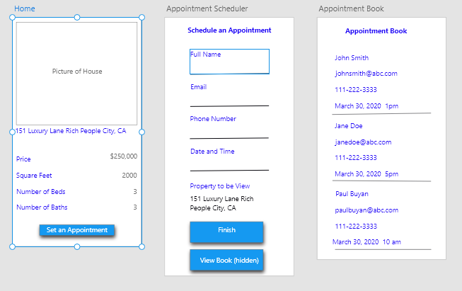

# Realtor Mobile

### Table of Contents
1. Purpose
2. Motivation
3. Objectives
4. Wireframe
5. Technologies Used

### Purpose:
A realty app that showcase homes for sales and creates an appointment to meet the realtor. 

### Motivation:
This project was used to practice developing with React Native and wire-framing with Adobe XD.  

### Objectives:
* The user can scroll through pictures of homes and details about the home.
* The user can make an appointment with the realtor for the house chosen. 
* The realtor can view their list of appointments. 

### WireFrame

### This app was built with the following technologies:
**React Native:** JavaScript mobile app framework 
 
**Git-Hub:** Web-based version control repository and Internet hosting service
 
**Flexbox:** A CSS based layout technology for building responsive websites

**Abode XD** A wire-framing tool used to create a mockup/visual of what is to be coded
  
**JavaScript:** Object-oriented programming language for web pages
 
**HTML:** Mark-up language for creating web pages 
 
**CSS:** A formatting language for styling web pages
 
*Create by JC Smiley in March of 2019*
